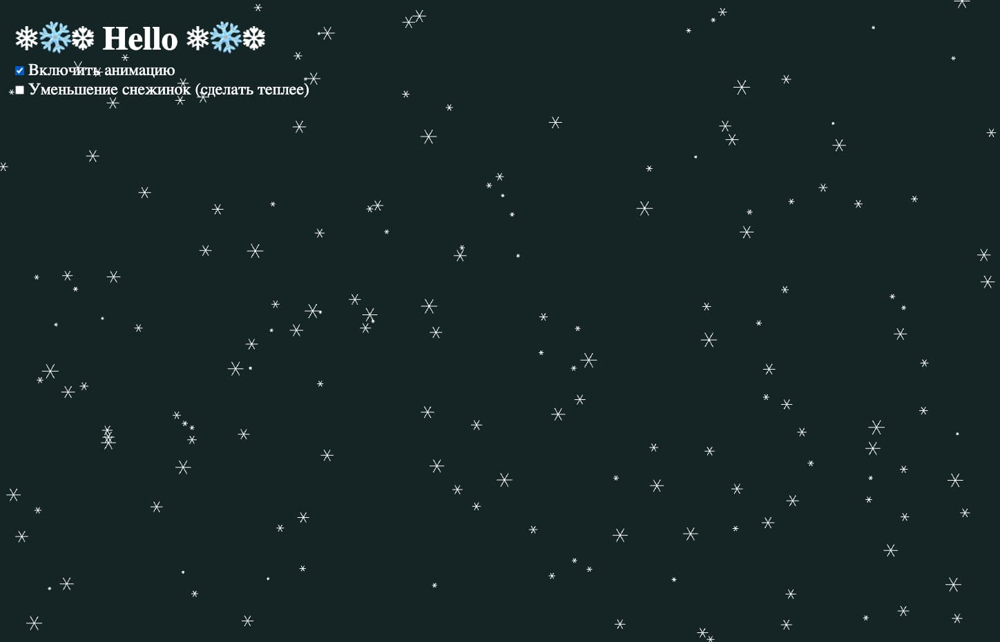

# Snowfall Animation

Этот проект представляет собой анимацию падающих снежинок, реализованную с использованием HTML5 Canvas и JavaScript.

## Функциональность

- Анимация падающих снежинок.
- Возможность включения/выключения анимации с помощью чекбокса.
- Возможность включения/выключения уменьшения размера снежинок с помощью чекбокса.
- Адаптация размера сцены при изменении размера окна браузера.

## Файлы

- `index.html`: Основной HTML файл, содержащий структуру страницы и подключение стилей и скриптов.
- `main.css`: Файл со стилями, включая сбрасывающие стили и стили для элементов управления.
- `main.js`: Основной JavaScript файл, содержащий логику анимации.

## Как использовать

1. Откройте `index.html` в браузере.
2. Используйте чекбоксы для включения/выключения анимации и уменьшения размера снежинок.

## Скриншот

